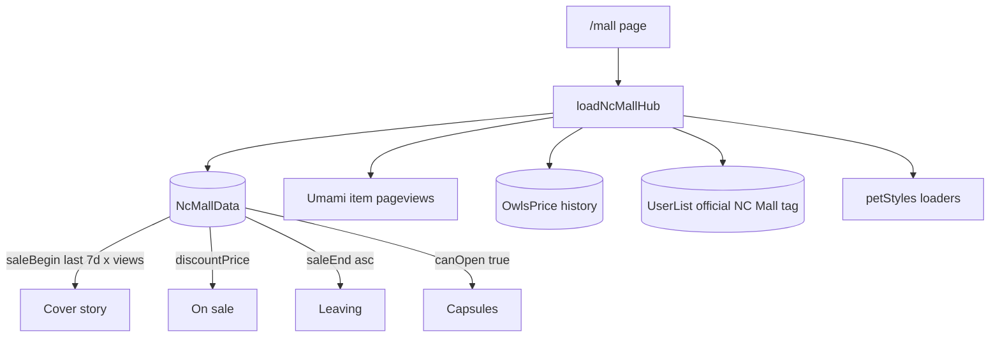

# Hub NC Mall Editorial — dados reais

O layout de `[app/[locale]/mall/concepts/editorial/](app/[locale]/mall/concepts/editorial/)` vira a página `/mall`. Fixtures, índice de comparação e os outros conceitos saem.

Nada de Prisma schema novo. A única ação humana fora do código é **taguear listas oficiais com `NC Mall`** (campo `official_tag` que já existe).

## Cover story

Regra: entre os itens com `NcMallData.active` e `saleBegin` nos últimos 7 dias, o de **maior pageview Umami** (mesma fonte de `[getTrendingItemsV2](services/item/trendingItems.ts)`, janela de 5 dias). Empate ou zero views → `saleBegin` mais recente.

O restante da semana vai para “Also new”. Se a semana estiver vazia, a capa usa o item mall mais novo (sem recorte de 7 dias) e a faixa “also new” some.

Descrição do item fica **só** a do banco. Preço/data são badges + uma linha gerada (`{price} NC · added {date}`), sem o texto atual que cola description + “Priced at… stocked alongside this week’s releases”.

## O que cada bloco puxa

| Bloco                   | Fonte                                                                                                                                                                                                       | Query nova?                                  |
| ----------------------- | ----------------------------------------------------------------------------------------------------------------------------------------------------------------------------------------------------------- | -------------------------------------------- |
| Novos / capa            | `[getNCMallData](pages/api/v1/mall/index.ts)` + Umami                                                                                                                                                       | Join de pageviews nos iids da semana         |
| On sale + “deepest cut” | `NcMallData` ativo com `discountPrice` e `discountEnd > now`                                                                                                                                                | Sim — hoje o mall loader não filtra desconto |
| Leaving + “next out”    | Mesmo dataset de hoje (`getNCMallData(100, true)`), **lista completa agrupada por `saleEnd`** — não um recorte com “view all” | Reusar [`buildLeavingMallPageProps`](app/[locale]/mall/leaving/buildLeavingMallPageProps.tsx) no hub |
| Lebron desk             | `OwlsPrice` (`isLatest: true`, `pricedAt` desc). Range anterior = última row `isLatest: null` do mesmo iid (o update em `[[tradings].ts](pages/api/v1/items/[id_name]/[tradings].ts)` já arquiva histórico) | Sim — query de hub, sem bater na API Lebron  |
| Eventos                 | Listas oficiais com tag `**NC Mall**` e `isEventActive` (`[ncTradeInsightsUtils.ts](app/_components/Item/NCTrade/ncTradeInsightsUtils.ts)`)                                                                 | Sim — filtro por tag + datas                 |
| Pet Styles              | `[loadRecentlyReleasedPetStyles(6)](app/server/petStyles.ts)` + `[loadRecentPetStyleCombos(4)](app/server/petStyles.ts)`; `inStudio` já vem no token                                                        | Não                                          |
| Populares               | Trending Umami filtrado `type === 'nc'`                                                                                                                                                                     | Filtro em cima do loader da home             |
| Cápsulas                | Mall ativo ∩ `Items.canOpen = 'true'`                                                                                                                                                                       | Sim — `canOpen` não está no intent `card`    |
| Quick links             | Estáticos                                                                                                                                                                                                   | Não                                          |

Seções **somem** quando o array vem vazio (eventos sem tag, mall sem desconto, etc.).

`now` sempre via `[getCachedNow()](utils/getCachedNow.ts)` — este Next.js recusa `Date.now()` no prerender.

## Copy (i18n `NcMall.*` em en + pt)

Sair do tom “issue de revista / design mock”; manter kickers curtos. **Title ≠ H1** (mesmo padrão Pet Styles: title carrega a query, H1 fica curto).

- Tirar o badge `Design mock · Editorial`
- H1 visível: “NC Mall” / “NC Mall” — não “The NC Mall, this week”
- Title (aba): ver seção SEO abaixo
- Lede sob o H1: 1–2 frases originais (o que a página *é*), não a meta description copiada
- Kicker da data: “Updated {date}” / “Atualizado em {date}” — `getCachedNow()`, não `ISSUE_DATE` fixo
- Masthead de contagens: só as seções que existem (`{n} new`, `{n} on sale`, …)
- Cover: “Featured” / “Destaque”; description do item só a do banco
- Lebron: “Value updates” / “Atualizações de valor”
- Sale / leaving asides gerados: “{n}% off”, “Leaves {date}”
- Pet Styles lede: `{n} available in the Styling Studio` só se `n > 0`
- Quick links traduzidos (report, Pet Styles, Lebron, search, outfits) — **sem** Leaving, que passa a ser seção da mesma página

Datas: `useFormatter()` / `getFormatter()`, não o `MONTHS` hardcoded de [`editorialFormat.ts`](app/[locale]/mall/concepts/editorial/editorialFormat.ts).

## SEO (foco do hub)

Espelhar o hub Pet Styles: [`PetStylesHubContent`](app/[locale]/rainbow-pool/pet-styles/components/PetStylesHubContent.tsx) (FAQ + FAQPage JSON-LD + breadcrumbs) e [`getStaticAppMetadata`](app/utils/appPage.ts) (canonical + hreflang en/pt). O hub herda também a query de leaving soon — a página dedicada some.

**Queries a cobrir (copy própria, sem keyword research novo neste PR):**

- Primária: Neopets NC Mall / NC Mall items
- Secundárias no body + FAQ **e agora no próprio hub**: new NC Mall items, NC Mall sale/discount, **leaving NC Mall / leaving soon**, Lebron values, NC Mall capsules, Pet Styles / Styling Studio
- Não primary: guia Jellyneo, how-to de compra no site oficial

**Metadata**

- `index, follow` (o mock está `noindex`)
- Title EN (rascunho): `Neopets NC Mall: new items, sales, leaving dates & Lebron values`
- Title PT (rascunho): `NC Mall do Neopets: itens novos, promoções, saída e valores Lebron`
- Description templated com contagens reais, incluindo leaving: `{nNew} new, {nSale} on sale, {nLeaving} leaving soon, plus Lebron cap updates.`
- Canonical `/mall` + hreflang via `getStaticAppMetadata`
- Open Graph: `twitter: { card: 'summary_large_image' }` e imagem do shopkeeper (`cashshop_new.png`)

**On-page**

- Um H1; H2 = títulos das seções (New / On sale / Leaving / Lebron / Events / Pet Styles / Popular / Capsules) para o crawler ver a intenção
- Breadcrumb visível + BreadcrumbList JSON-LD: Home → NC Mall
- FAQ no rodapé (5 Qs): o que é o NC Mall neste site; **quando um item sai do mall** (âncora `#leaving` na mesma página); o que é Lebron; mall price vs caps; onde reportar trade / Pet Styles
- FAQPage JSON-LD (mesmo helper do Pet Styles: pergunta + texto plano sem tags rich)
- Links internos com âncora útil: `#leaving`, `/mall/report`, `/rainbow-pool/pet-styles`, `/articles/lebron`, item pages, listas oficiais da tag NC Mall
- Conteúdo principal em RSC (já é o editorial) para o HTML sair completo no primeiro paint

**Descoberta**

- Incluir `/mall` em [`STATIC_SITEMAP_PATHS`](utils/sitemap.ts) e **tirar** `/mall/leaving`
- Home: `LatestNcMallHomeCard` e `LeavingNcMallHomeCard` → `href="/mall"` (leaving card pode apontar `/mall#leaving`)
- Nav Lists: só **NC Mall → `/mall`** (some o item “Leaving NC Mall”)

**Leaving mora no hub**

- A seção Leaving do editorial deixa de ser um recorte + “Full leaving list”. Absorve o layout atual de [`LeavingMallPageContent`](app/[locale]/mall/leaving/LeavingMallPageContent.tsx): grupos por data de `saleEnd`, todos os itens ativos com data de saída (limit 100, igual hoje), `id="leaving"` para âncora e FAQ
- “Next out the door” pode ficar como aside acima dos grupos
- H2 da seção usa a copy de leaving soon (`Leaving Soon™` / `Deixando o Mall™`) para herdar a query da página que some

**Matar `/mall/leaving`**

- Apagar `app/[locale]/mall/leaving/`
- 301 permanente em [`next.config.ts`](next.config.ts): `/mall/leaving` e `/pt/mall/leaving` → `/mall` (e `/pt/mall`). Mesmo padrão de `/owls/report` → `/mall/report/`
- Widget `leaving-ncmall` em [`pages/api/widget`](pages/api/widget/index.tsx) **fica** — é embed, não depende da rota
- Tag de cache `mall-leaving` some ou vira `mall-hub`

## Arquivos

- Promover o editorial para [`app/[locale]/mall/page.tsx`](app/[locale]/mall/page.tsx) + content/helpers no mesmo diretório; mover o agrupamento por data para fora de `leaving/` antes de apagar a pasta
- Loaders em `app/server/ncMallHub.ts` com `'use cache'`, tag `mall-hub` (revalidar junto de `home-latest-nc-mall` no sync de [`mall/sync.ts`](pages/api/v1/mall/sync.ts))
- Chaves `NcMall.hub-seo-title`, `hub-seo-description`, `hub-h1`, `hub-lede`, `faq-1…5` (+ `-text`) em [`translation/en.json`](translation/en.json) e [`pt.json`](translation/pt.json)
- FAQ + JSON-LD + breadcrumbs no content (espelho Pet Styles)
- [`utils/sitemap.ts`](utils/sitemap.ts): adicionar `/mall`
- Nav: em [`layoutData.ts`](components/Layout/layoutData.ts), item **NC Mall → `/mall`**; remover o link Leaving
- Home: ambos os cards NC Mall apontam para `/mall` (leaving com `#leaving`)
- Apagar `_mock/`, `concepts/`, `app/[locale]/mall/leaving/`
- Redirect 301 leaving → hub

## Operação (você)

Taguear as listas oficiais de atração/evento NC com `**NC Mall**` (mesmo formato de “The Void Within”). Até isso acontecer a seção de eventos não renderiza — o hub não quebra.

Opcional depois: entrada em `[listCategoriesData.ts](utils/lists/listCategoriesData.ts)` para `/lists/official/cat/nc-mall`. Fora deste PR.

## Fora de escopo

- API Lebron no request do hub
- Tabela nova de atrações
- Curadoria de capa
- `ncCapsulesInfo.ts` (odds manuais de cápsulas específicas) — a faixa lista cápsulas *no mall agora*, o detalhe de odds continua na página do item

