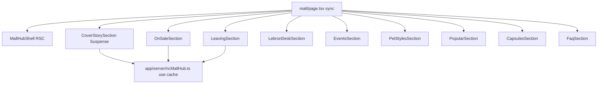

# Hub NC Mall — implementação por fases

Guideline de produto/SEO: plano Editorial (cover = popular da semana, tag `NC Mall`, matar `/mall/leaving`, FAQ/JSON-LD). Este plano só diz **como fatiar o código**.

Padrão de runtime (igual home + `[docs/app-router-cache.md](docs/app-router-cache.md)`):

- `page.tsx` **síncrono**; cada seção é um async RSC envolvido em `Suspense` com skeleton
- Loader com `'use cache'`, `cacheTag`, `cacheLife` — `now` só via `[getCachedNow()](utils/getCachedNow.ts)` **dentro** do cache
- Folhas client já existentes (`ItemCardV2`, `StyleTokenTile`, `ComboTile`, `ListCard`) — nenhum fetch no client
- Aliases `@app` / `@components`; i18n `NcMall.*` en+pt

Estrutura-alvo:

- `[app/[locale]/mall/page.tsx](app/[locale]/mall/page.tsx)` — shell + slots
- `app/[locale]/mall/MallHubShell.tsx` — hero, H1, breadcrumbs, SetMainColor
- `app/[locale]/mall/sections/*Section.tsx` — um arquivo por bloco
- `app/server/ncMallHub.ts` — loaders cacheados (cresce a cada fase)
- Reusar peças visuais de `[concepts/editorial/](app/[locale]/mall/concepts/editorial/)` até a fase de limpeza

Não editar `package.json`. Redirects em `[next.config.ts](next.config.ts)` só na fase de corte — confirmar contigo antes, regra do repo.

---

## Mobile-first (todas as fases)

O demo editorial **não é a baseline de layout estreito**. Tratar `base` como 360px (e não vazar em 320px). Desktop (`md`/`lg`) é o enhancement. Cada fase só fecha depois de olhar a seção a ~360px no `yarn dev` (en e pt — strings PT são mais longas).

Regras:

- Coluna única até `lg`. Capa acima do Lebron desk no mobile; grid 2 colunas só em `lg+`
- Todo flex/grid filho de rail precisa `minW={0}` — o `ItemStrip` com `overflowX: auto` no demo empurra a **página** inteira quando o ancestral não corta
- Rails horizontais: scroll só **dentro** da faixa (touch + peek do próximo card), nunca overflow do `body`
- `ItemCardV2` `small` no `base` (100px); não forçar 150px no telefone
- `StyleTokenTile` tem preview 120px — no hub 1 col no `base`, 2 no `sm`; o `SimpleGrid` 2/3/6 do demo estoura
- Títulos menores no `base`; nome longo da capa com `lineClamp` / `textWrap: balance`, sem H1 `5xl` no mobile
- Aside das faixas **embaixo** no `base`, ao lado só em `lg`
- Leaving: wrap de cards, data como heading full-width — não `HStack` que não quebra
- `sticky` do Lebron **só `lg+`**
- Skeletons com altura no `base` para não pular layout; alvos de toque ≥ 40px

Não copiar o demo e “depois ajustar”: o componente nasce no `base`.

## Fase 1 — Página (fundação)

Substituir o índice de comparação em `/mall` pelo hub de verdade, **sem dados de seção**.

- `generateStaticParams`, `generateMetadata` estático (`NcMall.hub-seo-title` / `hub-seo-description`), **indexável**, OG shopkeeper, canonical `/mall`
- Default export síncrono + `Suspense` de página (`AppServerLayoutSkeleton`)
- Shell: banner fluido (`w=100%`, altura menor no `base`), H1 “NC Mall” `size={{ base: '2xl', md: '4xl' }}`, lede, kicker “Updated {date}”, breadcrumbs (podem wrap)
- Slots vazios com skeleton empilhados no `base` (capa depois Lebron)
- Nav Lists: **NC Mall → `/mall`** (Leaving ainda aponta para `/mall/leaving` até o corte)
- Sitemap: adicionar `/mall` (leaving permanece até a fase 10)
- `/mall/leaving` e `concepts/` continuam no ar como referência

Entrega: `/mall` é uma página itemdb indexável, só chrome.

---

## Fase 2 — Cover + novos

- Loader: mall ativo, `saleBegin` últimos 7d, rank Umami (`[getTrendingItemsV2](services/item/trendingItems.ts)`); fallback `saleBegin` desc
- UI: cover empilhada (imagem → copy); faixa “also new” com rail que não vaza a página
- Description do item só a do banco; preço/data gerados
- Tag `mall-hub` + reusar `home-latest-nc-mall` se a query for a mesma família
- Seção some se não houver item mall ativo

---

## Fase 3 — On sale

- Loader novo: `NcMallData` ativo com `discountPrice` e `discountEnd > now`
- Faixa + aside “deepest cut” **abaixo** no `base`, ao lado só em `lg`
- Some se vazio

---

## Fase 4 — Leaving (bloco completo no hub)

- Reusar dataset de `[loadLeavingMallItems](app/[locale]/mall/leaving/page.tsx)` (`limit` 100, agrupado por `saleEnd`)
- UI: grupos por data com cards em wrap (`ItemCardV2` small no `base`) + aside “next out” abaixo no mobile; `id="leaving"`
- H2 = copy Leaving Soon™
- **Ainda não** apagar `/mall/leaving` — o hub ganha o conteúdo; a rota antiga fica até o 301

---

## Fase 5 — Lebron desk

- Loader: `OwlsPrice` `isLatest: true` order `pricedAt` desc; range anterior = row arquivada do mesmo iid
- UI sticky **apenas `lg+`**; no mobile lista compacta (thumb 40px, sem sticky)
- `cacheLife` tipo `homeFast`

---

## Fase 6 — Eventos / atrações

- Loader: listas oficiais tag `**NC Mall**` + `isEventActive`
- `FeaturedListsGrid` / `ListCard` em wrap centralizado; `isSmall` no `base`

---

## Fase 7 — Pet Styles

- `[loadRecentlyReleasedPetStyles](app/server/petStyles.ts)` + `[loadRecentPetStyleCombos](app/server/petStyles.ts)` (já cached)
- `StyleTokenTile` / `ComboTile` em grid 1 col `base` → 2 `sm` → mais no `lg` (não copiar o 6-col do demo)
- Lede com count `inStudio` só se `n > 0`

---

## Fase 8 — Populares NC + cápsulas

- Populares: trending Umami `type === 'nc'` + `HomeCard`
- Cápsulas: mall ativo ∩ `canOpen = 'true'` (query iid, depois intent `card`)
- Independentes: dois `Suspense`

---

## Fase 9 — FAQ + SEO restante

- 5 FAQs i18n + FAQPage JSON-LD (espelho Pet Styles)
- `generateMetadata` passa a usar contagens do loader cacheado (fallback estático se 0)
- Quick links (sem Leaving)
- Masthead de contagens no hero só com seções que existem (hero pode ter um RSC leve que lê os mesmos caches)

---

## Fase 10 — Corte leaving + limpeza

**Confirmar alteração de `next.config.ts` contigo.**

- 301 `/mall/leaving` e `/pt/mall/leaving` → `/mall` (`#leaving` não vai no 301; FAQ/home usam `/mall#leaving`)
- Apagar `app/[locale]/mall/leaving/`
- Sitemap: tirar `/mall/leaving`
- Nav: só NC Mall; home cards → `/mall` e `/mall#leaving`
- Apagar `_mock/` e `concepts/`
- Widget `leaving-ncmall` permanece
- `yarn lint` / `yarn typecheck`; testes unitários de rank da capa, % off, direção Lebron, `isEventActive`

---

## Cache (todas as fases)

| Loader              | tag                                            | cacheLife                     |
| ------------------- | ---------------------------------------------- | ----------------------------- |
| novos / capa / sale | `mall-hub` (+ `home-latest-nc-mall` no sync)   | inline 600s (igual home mall) |
| leaving             | `mall-hub` (substitui `mall-leaving` no corte) | 180s como leaving atual       |
| Lebron              | `mall-hub-lebron`                              | `homeFast`                    |
| eventos             | `mall-hub-events`                              | `homeSlow`                    |
| populares           | reusar `home-trending-items`                   | `homeSlow`                    |
| pet styles          | tags já existentes                             | como hoje                     |

Invalidar `mall-hub*` em `[mall/sync.ts](pages/api/v1/mall/sync.ts)` junto de `home-latest-nc-mall`.