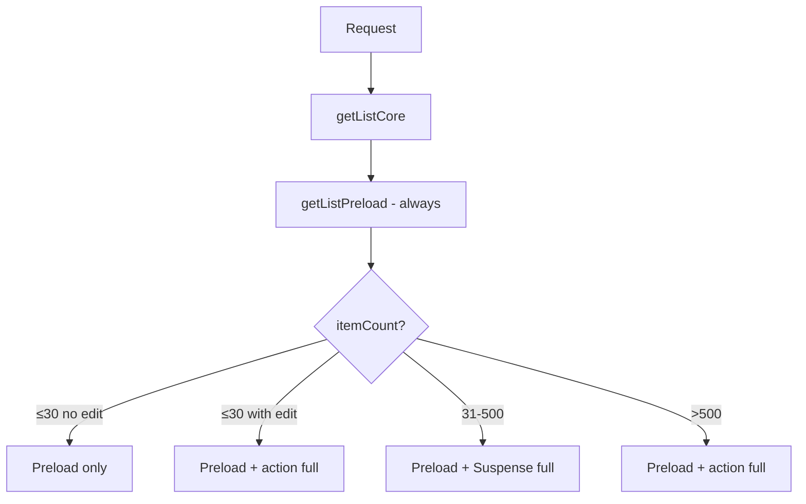

# List detail page (`/lists/[username]/[list_id]`)

Documentation for loading behavior, client state, and edge cases on this App Router route.

## Files

| File | Role |
|---|---|
| `page.tsx` | Server Component: metadata, layout, parallel preload, Suspense slot (tier 2) |
| `loadListPage.ts` | Server-only loaders with `'use cache'`, redirects, auth |
| `listPage.ts` | Types, constants, `getListLoadingStrategy`, sort helper |
| `actions.ts` | Server actions invoked from the client (filters, refresh, stats, full load) |
| `useListPageState.ts` | Hook: client state, tiers, handlers |
| `listPageStateHelpers.ts` | Pure functions (counts, merge guards, drag-sort) |
| `listPageSuspenseMerge.tsx` | Context + receiver that merges the Suspense payload |
| `ListPageClient.tsx` | UI only |

## Count used for the loading strategy

`getListLoadingStrategy` uses `UserList.itemCount` — the `visibleItemCount` field from the DB — **not** the number of rows already loaded on the client. This avoids reclassifying the tier as preload data arrives.

Constants in `listPage.ts`:

- `LIST_PRELOAD_LIMIT = 30` — items in the initial SSR payload
- `LIST_FULL_SERVER_LOAD_THRESHOLD = 500` — above this, full load moves to a client action (tier 3)

## Loading tiers

`getListLoadingStrategy(itemCount, { editorNeedsFullLoad })` defines four flags:

| Flag | Meaning |
|---|---|
| `needsFullLoad` | All items still need to be loaded (by count or for editors) |
| `useSuspenseFullLoad` | Tier 2: full load via Suspense on the server (31–500 items) |
| `useDeferredFullLoad` | Large list: full load is not done in SSR (only >500) |
| `useActionFullLoad` | Tier 3: full load via server action on the client |

### Case A — Small list, visitor or no edit permission (≤30 items)

```
itemCount ≤ 30  &&  !canEdit
```

| What happens | Detail |
|---|---|
| SSR | `getListPreload` → up to 30 visible items (no hidden) |
| Client | `needsFullLoad = false`, `isLoading` becomes `false` immediately |
| Suspense | Does not mount `{children}` |
| Action | Does not call `loadRemainingListItems` |

Preload is enough to show the entire list for non-editors.

### Case B — Small list, editor (≤30 items, `canEdit`)

```
itemCount ≤ 30  &&  canEdit
```

| What happens | Detail |
|---|---|
| SSR | Same 30-item preload (still **without** hidden items) |
| Client | `useActionFullLoad = true` → `loadRemainingListItems` on mount |
| Why | Preload omits hidden items; editors need the full dataset |

The user sees preload quickly; the action replaces it with the complete dataset (including hidden items for owner/admin).

### Case C — Medium list (31–500 items)

```
31 ≤ itemCount ≤ 500
```

| What happens | Detail |
|---|---|
| SSR | 30-item preload + header/matches/similar lists |
| Tier 2 | `ListFullItemsSlot` inside `<Suspense>` fetches `getListFullItems` |
| Suspense fallback | `null` if preload already has items; otherwise `ItemGridSkeleton` |
| Client | `useSuspenseFullLoad = true` → `{children}` slot **stays mounted** during filters |
| Merge | `ListFullItemsReceiver` applies the payload to client state |

Visual flow: preload appears → full load fills in the rest (or replaces everything on merge).

### Case D — Large list (>500 items)

```
itemCount > 500
```

| What happens | Detail |
|---|---|
| SSR | Preload only (30 items) |
| Suspense | Does **not** use tier 2 (`useSuspenseFullLoad = false`) |
| Tier 3 | `loadRemainingListItems` via server action after hydration |
| Why | Avoid huge RSC payloads and server render timeouts |

`isLoading` stays `true` until the action completes. Edit/filter controls are disabled while loading.

## Simplified diagram



## Server flow (first paint)

1. `getListCore` — resolves list, viewer, `canEdit`/`isOwner`, permanent redirects (308)
2. In parallel in `ListPageBody`:
   - `getListPreload(core)`
   - `getListMatches(core)` — only if logged in, not owner, list has seek/trade purpose
   - `getSimilarListsForList` — official lists only
3. `ListPageClient` receives `ListPageClientCore` (**without** serialized `viewer`)
4. If tier 2: `Suspense` → `getListFullItems` → `ListFullItemsReceiver`

## Server actions (post-hydration)

| Action | When | Returns |
|---|---|---|
| `loadRemainingListItems` | Tier 3 (action full load) | Full `ListItemsData` |
| `applyListFilters` | Filter modal | Filtered data, or full list if filters are empty |
| `refreshListData` | Save, discard changes, modals with refresh | Updated `{ list, items }` |
| `loadListStats` | Opening filter modal (lazy) | `SearchStats` |

All actions re-validate auth via `getListCore` on the server — the client only passes `locale`, `username`, `list_id`.

## Cache (`'use cache'`)

Tags in `utils/appCacheTags.ts`:

| Scope | Tag | Content |
|---|---|---|
| `preload` | `list-items:{user}:{id}:preload` | Initial 30 items |
| `full` | `list-items:{user}:{id}:full` | Full list (visitor) |
| `full-owner` | `list-items:{user}:{id}:full-owner` | Full list (owner or admin on official) |

Mutations on the API (`POST/PUT/DELETE` on `/api/v1/lists/...`) trigger immediate expiration for list tags (`revalidateTag(tag, { expire: 0 })`) and stale-while-revalidate (`'max'`) for everything else. `refreshListData` also calls `updateTag` before reading so the post-save refresh always sees fresh rows.

## Client merge: avoiding races

Several async sources can try to update the same state:

- Suspense full load (tier 2)
- Action full load (tier 3)
- `applyFilters`
- `refreshList`

### `requestGenerationRef`

Counter incremented on each “replace everything” operation (filter, refresh, deferred load). Responses with an old generation are ignored.

### Suspense-specific behavior

`ListFullItemsReceiver` freezes the generation on the **first** effect run. If the user applies a filter/refresh later, the Suspense merge is blocked even if the payload arrives late.

### `skipSuspenseMergeRef`

`true` when server filters are active (filter modal). Prevents tier 2 from overwriting a filtered result.

### Sort on merge

- Normal merge (Suspense/action): preserves current client `sortInfo` (`sortInfoRef`)
- `refreshList` after metadata changes: passes `sortFromList` with server `list.sortBy`/`list.sortDir`

### `{children}` slot always mounted (tier 2)

Render condition: `!isLoading || itemInfoIds.length > 0 || useSuspenseFullLoad`

Prevents unmounting the Suspense receiver when filters clear `itemInfoIds` during loading — a bug that re-applied the full list after filtering.

## Filters vs search

| Type | Where | Behavior |
|---|---|---|
| **Server filters** | `SearchFilterModal` | `applyListFilters` → server action; clears rows and refetches; increments generation |
| **Client search** | `SearchList` | Filters `itemInfoIds` by name on the client; no refetch |

`hasListViewFilter = isServerFiltered || searchQuery is non-empty`

Effects when a view filter is active:

- Drag-sort disabled (`activateSort = false`, lock-sort switch disabled)
- Message `Lists.drag-sort-disabled-filter`
- `lockSort` forced to `true`

## Edit mode

- Enabled via switch or forced item selection
- Drag-sort only when `sortBy === 'custom'`, `lockSort = false`, and no view filter
- `hasChanges` tracks `ExtendedListItemInfo.hasChanged`
- Save: `POST /api/v1/lists/{user}/{id}` → `refreshList` on success
- `UnsavedChangesActionBar`: cancel calls `refreshList` (discards local changes)

**Hidden items:** preload never includes hidden rows. Editors on lists ≤30 rely on action full load. Owners and admins see hidden items on any list (`ListService.canViewHiddenListItems`).

## Displayed counts

| Field | Used for |
|---|---|
| `qtyCount.visibleQty` | Main label (`Lists.itemcount-items`) — sum of quantities |
| `qtyCount.visible` | Tooltip “unique” — during tiered load without server filter, uses DB `list.itemCount` |
| `qtyCount.hidden` | Tooltip |
| `qtyCount.totalQty` | Tooltip |

## Permissions

| Flag | Rule |
|---|---|
| `canEdit` | `viewer.id === owner.id` OR `viewer.isAdmin` |
| `isOwner` | `viewer.id === list.owner.id` |
| Client receives | Only `canEdit`, `isOwner`, `list` — **never** the `viewer` object |

## Redirects (308 permanent)

In `resolveListCore`:

1. Dynamic list of type `search` → `/search?list_id=...`
2. Numeric URL with existing slug → `/lists/{user}/{slug}`
3. Official list accessed with wrong username → `/lists/official/{slug}`

## Errors

| Situation | UX |
|---|---|
| Action full load fails | Toast `General.refreshPage`, `isLoading` stays (blocks editing) |
| `applyFilters` fails | Toast `General.refreshPage`, grid may stay empty until manual refresh |
| `refreshList` fails | Toast + `setLoading(false)` |

## Mutations and manual refresh

- `AddListItemsModal` does **not** call `refreshList` automatically — user must refresh the page
- `CreateListModal` and `ItemActionModal` receive `refresh={() => refreshList()}`

## Known limitations

1. **Preload is not DB-bounded** — `preloadListItems` loads all rows, sorts, then `splice(0, 30)`. The gain is in RSC payload size, not query cost.
2. **Filtered loads fetch the full item map** — `getFilteredListItems` filters `itemInfo` but `getListItems` still returns the entire list map.
3. **No error boundary** on Suspense full load — server failure leaves partial preload without automatic recovery.

## Tests

| File | Covers |
|---|---|
| `test/listPageLoading.test.ts` | `getListLoadingStrategy` (all tiers) |
| `test/getSortedListItemInfo.test.ts` | Sort without mutating input |
| `test/listPageStateHelpers.test.ts` | Pure helpers (filters, merge guards, counts) |
| `test/appCacheTags.test.ts` | Tag format |

There are no integration tests for the hook or Suspense/action flow yet.

## Manual QA checklist

- [ ] List ≤30 as visitor: preload only, no prolonged loading
- [ ] List ≤30 as editor: preload → action with hidden items
- [ ] List ~100: preload → Suspense merge
- [ ] List >500: preload → skeleton → action
- [ ] Apply filter on tier-2 list: filtered result not overwritten
- [ ] Name search + edit custom sort: drag-sort disabled
- [ ] Save + refresh: order/qty persisted
- [ ] Admin on any list (official or user): can edit and sees hidden items
