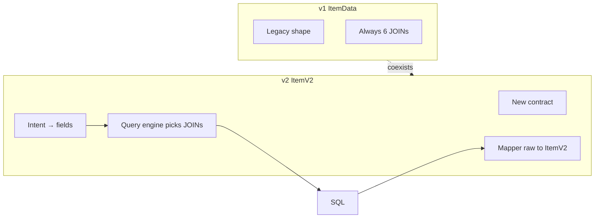
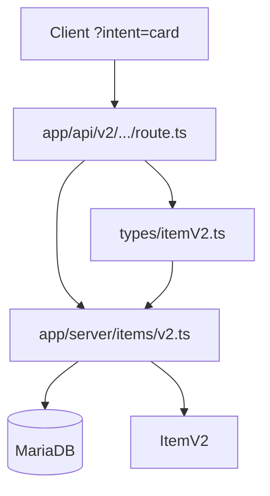

# API v2 — ItemV2 + Intents Migration

This migration is expected to take **several weeks**. v1 (`ItemData` + `/api/v1`) stays stable; v2 is opt-in.

## Goals

1. **New HTTP contract** (`ItemV2`) — breaking reshape, not just fewer fields.
2. **Intents** — presets in `itemIntents` (`minimal` | `card` | `full` | `pricer`); query engine derives JOINs from the fields each intent needs.
3. **Typing** — UI consumes `ItemV2`; `ItemData` becomes `@deprecated`.
4. **Lean layout:** legacy types under `/types` (file moved intact); ItemV2 helpers/registry under `/types`; server runtime under `app/server/items/`; client helpers in `utils/item/v2.ts`; HTTP in `route.ts`.
5. **Coexistence** — no breaking changes to `/api/v1` during the migration.

## Current problem

- [`pages/api/v1/items/many.ts`](../pages/api/v1/items/many.ts) always runs ~6 LEFT JOINs and `rawToItemData` builds the full envelope.
- Cards/lists use ~12 fields but still pay for SaleStats, NC values, mall, color lab/hsv, etc.
- Search already has conditional joins in [`utils/search/queryBuilder.ts`](../utils/search/queryBuilder.ts) — for filter/sort only, not response shape.
- There is no HTTP `/api/v2`. App Router `getItemV2` is a server-side loader, **not** a public API.


---

## `ItemV2` contract (locked)

Lives in [`types/itemV2.ts`](../types/itemV2.ts) (not in the legacy blob). Re-exported via `@types`.

```ts
export type ItemV2 = {
  internal_id: number;
  item_id: number | null;
  name: string;
  description: string;
  image: { url: string; id: string; hash?: string };
  category: string | null;
  rarity: number | null;
  weight: number | null;
  type: 'np' | 'nc' | 'pb';
  flags: ItemFlags[];
  estVal: number | null;
  status: string | null;
  colorHex: string | null;
  price: ItemPriceField;
  slug: string | null;
  comment: string | null;
  canonical_id: number | null;
  firstSeen: string | null;
  useTypes: UseTypes;
};
```

### Diff vs `ItemData`

| v1 | v2 |
|----|-----|
| `image` + `image_id` + `cacheHash` | `image: { url, id, hash? }` |
| `isWearable`, `isNeohome`, `isBD`, `isMissingInfo`, `flags` (CSV) | `flags: ItemFlags[]` |
| `isNC` | `type === 'nc'` |
| `color` (lab/rgb/hsv/hex/…) | `colorHex` |
| `price` + `ncValue` + `mallData` | discriminated `price` |
| `inflated: boolean` | `price.flags` |

### Outside the core envelope (locked)

| Concern | Where it lives |
|---------|----------------|
| RGB / LAB / HSV | Prefer hex in CSS (`colorHex` / 8-digit alpha). RGB helpers only if a caller truly needs them |
| `findAt` | **Client** (`getItemFindAtLinks` adapted for `ItemV2`) |
| `saleStatus` | **Deferred** — keep existing `/saleStats` sub-route for now; `+sales` intent later |

### `price` mapping rules (mapper)

1. NC + active mall → `{ ...mall, type: 'ncMall' }` (**mall wins** over ncValue)
2. NC + ncValue → `{ ...ncValue, type: 'ncValue' }`
3. NP with a price → `ItemPriceV2`
4. NP unknown/stale → `value: 0`, `flags` includes `'unknown'`
5. NP older than 6 months → `flags` includes `'outdated'` (same rule as `ItemCardBadge`)
6. Otherwise → `null`

### `ItemData` deprecated

```ts
/**
 * @deprecated Use `ItemV2` for new code. Kept for `/api/v1` and unmigrated call sites.
 * @see ItemV2
 */
export type ItemData = { /* … */ };
```

Actual removal only after hot-path migration — not in this wave.

---

## Intents

| Intent | Contents |
|--------|----------|
| `minimal` | ids, name, slug, image, type, flags, description, status |
| `card` | + colorHex, price, rarity, category, estVal |
| `pricer` | minimal + rarity + price |
| `full` | every `ItemV2` field (resolved from the query-engine field registry — not hand-listed) |

Single registry: `itemIntents` in [`types/itemV2.ts`](../types/itemV2.ts) drives `ItemIntent`, `ItemV2For<>`, field lists, and HTTP validation (`parseItemIntent`).  
**JOINs** are decided by the query engine from the fields each intent needs — not declared in the types registry.

**Deferred:** `+sales` / `SaleStats` on the ItemV2 envelope — use `/saleStats` until a later wave.

No HTTP intent for `findAt` — always client-side.

---

## Target architecture

### Folder layout

```
types/
  types.d.ts                 # ROOT types.d.ts MOVED INTACT (do not refactor the legacy blob)
  itemV2.ts                  # ItemV2 contract, intents (fields), ItemV2For
  index.ts                   # @types alias entry: re-export legacy + itemV2

app/server/items/v2.ts       # query engine + mapItemV2 + getManyItemsV2 + getItemV2
app/server/items/itemV2Price.ts  # isolated price-union mapping
app/server/items/itemV2Raw.ts    # raw SQL normalization helpers
app/server/items/getItemForPage.ts  # App Router item-page loader (legacy ItemData)

app/api/v2/
  items/many/route.ts
  items/[id_name]/route.ts
  items/parse.ts             # many-query parsing (intent via parseItemIntent/@types)

utils/item/v2.ts             # client runtime helpers: hasFlag, itemColorRgb, findAt
```



### Phase 0 — types ✅

**1. Move `types.d.ts` → `/types` without changing the rest of the file**

- Moved as-is to `types/types.d.ts` (demo `ItemV2` draft removed — contract lives in `itemV2.ts`).
- `ItemData` marked `@deprecated`.
- Updated `tsconfig.json`: `"@types"` → `./types/index.ts`; `include` / `typeRoots` for the new path.
- Call sites `from '@types'` stay the same.

**2. Create ItemV2 TypeScript helpers under `/types`**

- `types/itemV2.ts`: contract (`ItemV2`, `ItemPriceField`, …), `itemIntents` (fields only), `ItemIntent`, `ItemV2For<>` — TypeScript only (no Prisma/HTTP). JOINs belong to the query engine.
- `types/index.ts` re-exports legacy + `itemV2`.

**3. Rename App Router loader**

- `getItemV2` → `getItemForPage` (`app/server/items/getItemForPage.ts`) — still returns legacy `ItemData`; avoids clash with the future public ItemV2 stack.

**Not in this types step:** SQL query, runtime mapper, Route Handlers, UI.

### HTTP on the App Router

- `app/api/v2/...` Route Handlers; v1 stays under `pages/api/v1/`.
- Covered by `/api/:path*` in [`proxy.ts`](../proxy.ts).

### Suggested imports

```ts
import type { ItemV2, ItemFlags, ItemData } from '@types'; // ItemData deprecated
import { itemIntents, type ItemIntent } from '@types';

import { getManyItemsV2 } from '@app/server/items/v2';
import { getItemForPage } from '@app/server/items';
import { getItemFindAtLinksV2 } from '@utils/item/v2';
```

---

## Migration phases

### Phase 0 — `/types` + ItemV2 TS helpers ✅

**Goal:** Legacy under `/types` (intact move); ItemV2 registry/helpers under `/types`; `ItemData` deprecated; `@types` alias OK; loader renamed.

**Done when:** typecheck green; `from '@types'` unchanged; `types/itemV2.ts` exists; no new API/UI yet.

---

### Phase 1 — Server v2 (query + mapper) ✅

**Goal:** ItemV2 DAL under `app/server/items/`, with orchestration in `v2.ts` and focused raw/price helpers (consumes registry from `@types` / `types/itemV2.ts`).

**Done when:** tests for price union / flags / `minimal` intent; v1 untouched.

---

### Phase 2 — App Router HTTP POC ✅

**Goal:** `app/api/v2/items/many` and `[id_name]`.

**Done when:** responses are `ItemV2`; benchmark recorded; v1 identical.

#### HTTP surface

| Route | Methods | Default intent | Notes |
|-------|---------|----------------|-------|
| `/api/v2/items/many` | `GET`, `POST` | `minimal` | Same lookup keys as v1 (`id`, `item_id`, `name_image_id`, `image_id`, `name`, `slug`) + `intent` |
| `/api/v2/items/[id_name]` | `GET` | `minimal` | Lookup by `internal_id`, `slug`, or `name`; `404` when missing. No PATCH/DELETE (stay on v1) |

Query/body: `?intent=` any key of `itemIntents` (`minimal` \| `card` \| `full` \| `pricer`). Rate limiting remains in `proxy.ts` (`/api/:path*`).

#### Benchmark (2026-07-14)

50 random items × 5 runs via `yarn tsx -r dotenv/config scripts/bench-item-v2.ts`:

| Loader | avg ms | JOINs | Approx JSON bytes / item |
|--------|--------|-------|---------------------------|
| v1 `getManyItems` | 404.5 | 6 fixed | ~1244 |
| v2 `card` | 405.3 | color + price JOINs | ~380 |
| v2 `minimal` | 274.9 | none | — |

Takeaway: `minimal` is clearly cheaper; `card` payload is ~3× smaller than v1 even when wall time is similar on this machine (warm cache / remote RTT can dominate JOINs).

---

### Phase 3 — Search v2

**Goal:** `app/api/v2/search` (default intent `card`).

**Done when:** parity on critical filters; smaller payload in the simple case.

---

### Phase 4 — UI core

**Goal:** Card/home/lists on `ItemV2`.

**Order:** Image/Badge → CtxMenu/FindAt → ItemCard → home/lists.

**Done when:** hot paths on `ItemV2`; visual parity.

---

### Phase 5 — Broad adoption

**Goal:** Remaining call sites; reduce `ItemData`.

---

### Phase 6 — Public docs and stabilization

**Goal:** v1→v2 changelog; stabilize this document and API reference.

---

## UI checklist (Phase 4+)

| Component / helper | Contract |
|--------------------|----------|
| `ItemImage` / `ItemImageV2` | `image`, `description` |
| `ItemCardBadge` / `ItemCardBadgeV2` | `price` union, `type`, `status`, `flags` |
| `ItemCtxMenu` / `ItemCtxMenuV2` | core + **client** findAt (`getItemFindAtLinksV2`) |
| `getRestockProfit` / `getRestockProfitV2` | np price + category/rarity/estVal |
| `ItemCard` / `ItemCardV2` | intent `card` (`components/Items/v2/ItemCardV2.tsx`, client component — `onSelect`/`onListAction` are plain client callbacks, not Server Actions, so it can't be a real Server Component) |
| `FindAtCard` | core + client findAt + colorHex→rgb |
| Item page | `full` (sales via `/saleStats` until later) |
| Search / Home | `card` |
| Widget | `minimal` |

---

## Risks

- Types move: typecheck before new logic.
- Card ↔ CtxMenu: client findAt needs the right core fields.
- Search: filters may force JOINs beyond the intent.
- `@deprecated` alone does not fail CI — review discipline + Phase 4+.

## Out of scope

- Refactoring/splitting the **contents** of `types.d.ts` during the move (relocation only)
- GraphQL; free-form field masks; breaking v1 writes
- Renaming `internal_id` → `id`
- Embedding findAt/RGB in the HTTP envelope
- Removing `ItemData` (deprecate only)
- `+sales` / embedding `saleStatus` in ItemV2 (later wave; use `/saleStats`)

## Next steps

1. ~~**Phase 0:** move `types.d.ts` → `/types` + `types/itemV2.ts` + tsconfig + rename loader.~~
2. ~~**Phase 1:** `app/server/items/v2.ts` (query + mapper).~~
3. ~~**Phase 2:** `app/api/v2/items/many` + `[id_name]` Route Handlers + benchmark vs v1.~~
4. **Phase 3:** `app/api/v2/search` (default intent `card`).
