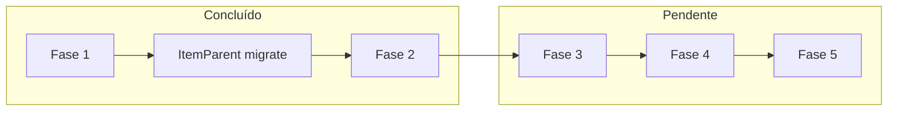

# Review fixes — PR #22 (App Router Item Page)

Plano de endereçamento dos achados do [multi-model review](https://github.com/lucca180/itemdb/pull/22). Complementa [`item-page-migration.md`](./item-page-migration.md). Migrações Price/NCTrade (Fase 6) documentadas lá.

**Última atualização:** jun/2026

## Status geral

| Fase | Tema | Status |
|------|------|--------|
| 1 | Regressões e bugs claros | ✅ Concluída |
| — | Migração `ItemParent` → `app/_components/Item/ItemParent/` | ✅ Concluída (extra) |
| 2 | Dedupe de queries | ✅ Concluída |
| 3 | Cache tags + invalidação admin | ⏳ Pendente |
| 4 | Resiliência e UX de streaming | ⏳ Pendente |
| 5 | Arquitetura ISR, bdData, testes | ⏳ Pendente |



---

## Fase 1 — Regressões e bugs claros ✅

### 1.1 Outfit loader: cache compartilhado ✅

- **Arquivo:** [`ItemPageOutfitSectionLoader.tsx`](../app/_components/Item/page/ItemPageOutfitSectionLoader.tsx)
- **Feito:** `getItemDrops()` substituído por `loadItemOpenableMeta(item)` — mesma cache que `ItemDropsSection`.

### 1.2 Ordem dos cards na coluna principal ✅

- **Arquivo:** [`ItemPage.tsx`](../app/_components/Item/page/ItemPage.tsx)
- **Feito:** `ItemPageMainColumnExtras` (petpet + comments) movido para **depois** de MME → dye → recipes e **antes** de drops — paridade com a página Pages Router.

### 1.3 Parent items ✅ (abordagem diferente do plano original)

O plano original previa `getItemParent(..., 4)` no loader central. Evoluímos para:

- Fetch completo no **server** (sem request no client)
- Card movido para [`app/_components/Item/ItemParent/`](../app/_components/Item/ItemParent/)
- `itemParent` **removido** de [`loadItemPage.ts`](../app/utils/loadItemPage.ts)
- Dois arquivos: `ItemParent.tsx` (server + `unstable_cache` inline) + `ItemParentGrid.tsx` (client só para show more/less)

Ver seção **parent/** em [`item-page-migration.md`](./item-page-migration.md).

### 1.4 Admin edit: erro no fetch de openable ✅

- **Arquivos:** [`ItemPageAuthGates.tsx`](../app/_components/Item/page/ItemPageAuthGates.tsx), [`EditItemModal.tsx`](../components/Modal/EditItemModal.tsx)
- **Feito:**
  - Estado `itemOpenableLoadError` + `.catch()` no fetch
  - Props `itemOpenableLoadError` e `onRetryItemOpenable` no modal / `OpenableTab`
  - Em erro: mensagem + retry; **não** inicializa `defaultItemOpenable`

---

## Fase 2 — Dedupe de queries ✅

### 2.1 Duplo `getItem` por request ✅

- **Arquivo:** [`loadItemPage.ts`](../app/utils/loadItemPage.ts)
- **Feito:** `getItemPageData` recebe `ItemData` já resolvido; `resolveItemPage` passa `item` direto — um `getItem` por request.

### 2.2 Duplo `getItemLists(iid, true)` ✅

- **Arquivos:** [`loadItemPage.ts`](../app/utils/loadItemPage.ts), [`avys.ts`](../pages/api/v1/items/[id_name]/avys.ts)
- **Feito:**
  - `getOfficialItemLists` com `React.cache`
  - `getAvyData(item_iid, officialLists?)` — reutiliza lists já buscadas via `.then()` no `Promise.all`
  - API route `/avys` inalterada (continua sem passar lists)

### 2.3 `SKIP_ITEMS` duplicado ✅

- **Arquivos:** [`drops.ts`](../pages/api/v1/items/[id_name]/drops.ts) (export), [`loadItemDrops.ts`](../app/_components/Item/drops/loadItemDrops.ts) (import)

### 2.4 Similar items — card vazio ⏭️ Decisão explícita

- **Plano original:** retornar `null` quando sem similares (evitar skeleton + card vazio).
- **Decisão atual:** manter card com texto `ItemPage.suggestion-fail` quando vazio — comportamento desejado pelo produto.
- **Arquivo:** [`SimilarItemsCard.tsx`](../app/_components/Item/similarItems/SimilarItemsCard.tsx)

### 2.5 `loadSimilarItemData` sem re-fetch de item ✅

- **Arquivo:** [`loadSimilarItems.ts`](../app/_components/Item/similarItems/loadSimilarItems.ts)
- **Feito:** recebe `ItemData`; cache key `(internalId, itemName)`; sem `getItem` extra.

---

## Fase 3 — Cache coherency ⏳

Objetivo: alinhar `unstable_cache` das seções com invalidação admin (padrão da home em [`HomeServerCards.tsx`](../app/_components/Home/Cards/HomeServerCards.tsx)).

### 3.1 Helper de tags

Criar [`app/utils/itemCacheTags.ts`](../app/utils/itemCacheTags.ts) (só se fizer sentido — pode ser inline no primeiro uso):

```ts
export const itemCacheTag = (internalId: number) => `item-${internalId}`;
export const itemDropsTag = (internalId: number) => `item-drops-${internalId}`;
```

### 3.2 Adicionar `tags` aos caches da item page

Arquivos afetados:

- [`loadItemDrops.ts`](../app/_components/Item/drops/loadItemDrops.ts)
- [`MMECard.tsx`](../app/_components/Item/mme/MMECard.tsx)
- [`DyeCard.tsx`](../app/_components/Item/dye/DyeCard.tsx)
- [`ItemRecipesCard.tsx`](../app/_components/Item/recipes/ItemRecipesCard.tsx)
- [`loadSimilarItems.ts`](../app/_components/Item/similarItems/loadSimilarItems.ts)
- [`ItemParent.tsx`](../app/_components/Item/ItemParent/ItemParent.tsx)

### 3.3 `revalidateTag` em `revalidateItem`

- **Arquivo:** [`effects.ts`](../pages/api/v1/items/[id_name]/effects.ts)
- Estender assinatura se necessário (hoje só recebe `slug`; tags precisam de `internal_id`)
- Manter `res.revalidate` + `revalidatePath`; envolver tudo em `Promise.allSettled`

### 3.4 TTL alignment

- Page: `revalidate = 60` em [`page.tsx`](../app/[locale]/item/[slug]/page.tsx)
- Com tags + `revalidateTag` on edit → TTL longo (1h) ok para MME/dye/recipes/parent
- Drops: documentar escolha (5–10 min vs 60s)

**Recomendação:** PR dedicado — toca fluxos admin em múltiplos endpoints.

---

## Fase 4 — Resiliência e UX de streaming ⏳

| Item | Descrição |
|------|-----------|
| 4.1 Metadata leve | `resolveItemRoute(slug)` só com `getItem` + redirect/notFound para `generateMetadata` |
| 4.2 Falha parcial | `Promise.allSettled` em `fetchItemPageData` com defaults seguros |
| 4.3 Suspense shells | Fallbacks para MME, Dye, Recipes (hoje `null`) |
| 4.4 Error boundaries | Wrapper por seção Suspense (drops, MME, dye, recipes, similar, parent) |
| 4.5 `isPetDayCapsule` DRY | Extrair de outfit loader + section para util compartilhado |
| 4.6 Nits | `lists` non-optional, `params.locale` em metadata, `maxW: 100vh` → `100%`, `MainLink` → `@i18n/navigation` em drops |

---

## Fase 5 — Arquitetura, docs e testes ⏳

| Item | Descrição |
|------|-----------|
| 5.1 ISR vs dynamic | `yarn build` → inspecionar rota item; `AppServerLayout` usa `cookies()`/`headers()` |
| 5.2 `bdData` null | TODO ou remover do type até implementar `getBDData` |
| 5.3 Testes | `resolveItemPage`, `SKIP_ITEMS`, smoke render por tipo de item |
| 5.4 Checklist manual | NP/NC/wearable/openable/MME/dye/recipes/parent/admin; locales en+pt; lint+typecheck |

---

## Achados do review — referência rápida

| Severidade | Achado | Status |
|------------|--------|--------|
| Critical | Outfit loader sem cache | ✅ Fase 1.1 |
| Critical | Card order regression | ✅ Fase 1.2 |
| Critical | Cache tags / ISR mismatch | ⏳ Fase 3 |
| Warning | `getItemParent` limit 4→30 | ✅ Substituído por migração parent/ |
| Warning | Admin edit fetch sem error | ✅ Fase 1.4 |
| Warning | Duplo `getItem` | ✅ Fase 2.1 |
| Warning | Duplo `getItemLists` | ✅ Fase 2.2 |
| Warning | `SKIP_ITEMS` duplicado | ✅ Fase 2.3 |
| Warning | `revalidatePath` from Pages API | ⏳ Fase 3 |
| Warning | Dynamic layout vs `revalidate=60` | ⏳ Fase 5.1 |
| Warning | Metadata dispara loader completo | ⏳ Fase 4.1 |
| Nit | Similar items skeleton flash | ⏭️ Mantido fallback text |
| Nit | Suspense fallbacks inconsistentes | ⏳ Fase 4.3 |
| Nit | Sem testes automatizados | ⏳ Fase 5.3 |

---

## Ordem de execução recomendada (restante)

1. **Fase 3** — cache tags (PR dedicado, risco médio)
2. **Fase 4** — resiliência incremental
3. **Fase 5** — investigação ISR + testes

Fases 1–2 e migração `parent/` podem ir no PR #22 ou follow-up imediato.
